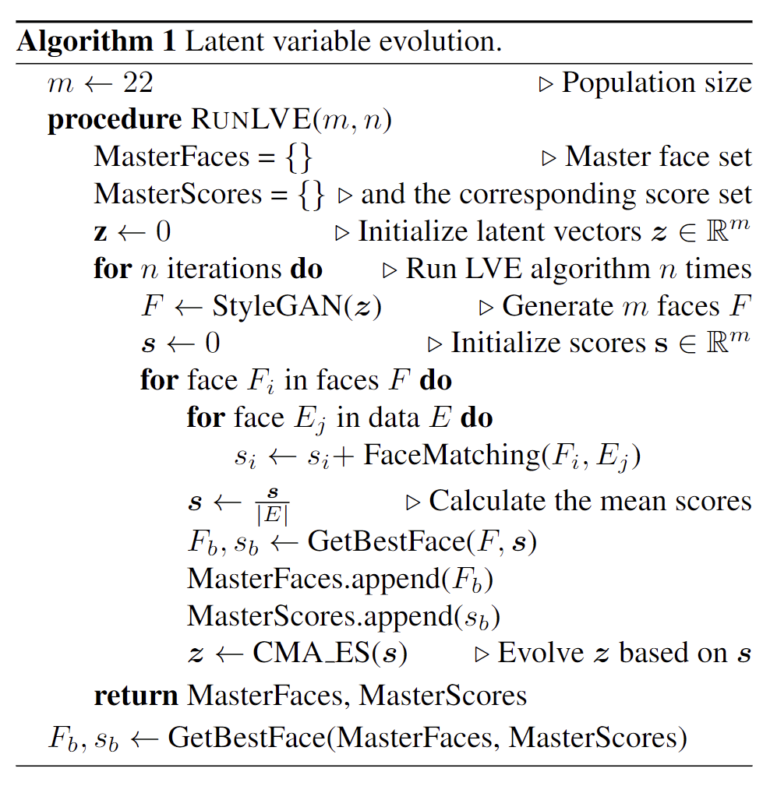

# MasterFace算法实现

## LVE算法

将生成的图片与人脸识别系统中注册的每张图片计算相似度




## 一些要点

- 输入网络的随机向量的维度`G.z_dim`为512

- 使用`Bob`工具箱实现图片比较

  `*abstract compare(enroll_templates,** probe_templates)`

  ```python
  Computes the similarity score between all enrollment and probe templates.
  ```

  [相关链接](https://www.idiap.ch/software/bob/docs/bob/docs/stable/bob/bob.bio.base/doc/py_api.html)

- 