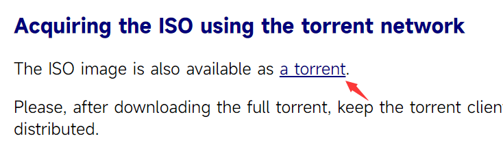

# Latex 笔记

## 下载安装 `Tex Live` 

1. 点击进入[下载页面](https://tug.org/texlive/acquire-iso.html)



2. 点击图中按钮，使用`迅雷`下载后，解压安装，安装时一直下一步即可，耗时大约半小时左右

3. 在 `Visual Studio Code` 中安装 `LaTeX Workshop` 扩展

## 使用 `OverLeaf` 

> `OverLeaf` [中文网站](https://cn.overleaf.com/)

- 在 `OverLeaf` 中显示中文

   1. 在`overleaf`的`菜单`中选择编译器为`XeLaTex`

   2. 在代码中插入`\usepackage{ctex}`

         ```latex
         \documentclass{article}
         \usepackage{ctex}
         
         \begin{document}
         \maketitle
         \section{Introduction}
         中文
         \end{document}
         ```

## Latex 命令

> `Latex` 所有命令都以`\`开头，后面的`{}`代表命令的参数

- `\documentclass`代表文档的类型

  `article`代表普通的文章，其他常用的还有`book`、`report`等

- `\title`、`\author`、`\date`

  > 位于`\begin{document}`之前的内容被称为前言（Preamble）类似HTML中的head标签，可以在其中指定文档的格式，页面的尺寸，也可以指定文档中需要导入的宏包，以及其他信息等

  ```latex
  \title{文章的标题}
  \author{罗斯}
  \date{\today}
  ```

- `\begin`

  介于`\begin{document}`和`\end{document}`之间的内容成为文档的正文，在其中的内容会被排版到最终生成的文档中

  > 使用`\maketitle`命令，来编译`\begin`之前前言区设置的信息

## Latex 格式化命令

- `\textbf` 加粗，*`bold font`*

  需要加粗的内容写在`{}`中

  ```latex
  \textbf{内容}
  ```

- `\textit` 斜体，*`italic`*

  ```latex
  \textit{内容}
  ```

- `\underline` 下划线

  ```latex
  \underline{内容}
  ```

- `\section` 开启新的章节

  ```latex
  \section{章节名称}
  ```

- `\subsection` 开启子章节

  ```latex
  \subsection{子章节名称}
  ```

- `\subsubsection` 开启三级章节

  ```latex
  \subsubsection{三级章节名称}
  ```

- 对书籍进行排版时，可以使用 `\chapter` 来表示书籍的第几章，`\chapter` 比 `\section` 层级更大

  ```latex
  \chapter{章节}
  ```

- 比`\chapter` 更大的还有 `\part` 表示书籍中的第几部

## 其他操作

`LaTex` 中的环境：任何介于`\begin{}`和`\end{}`之间的内容属于一个环境，同一环境中的内容共享相同的文字格式

- 开启新的一段：使用两个换行符

- 添加图片

  需要在文档中添加 `graphicx` 包，其中包含若干绘制图片的指令

  ```latex
  \usepackage{graphicx}
  ```

  - 可以使用 `\includegraphics`命令在当前位置添加一张图片 

  - 使用`\centering`、`\caption` 命令使图片居中显示以及指定图片标题

    > 使用这些命令需要将图片嵌套在一个 `figure` 环境中

    ```latex
    \begin{figure}
    \centering
    \includegraphics[width=0.5\textwidth]{head}
    \caption{图片标题}
    \end{figure}
    ```

- 创建列表

  - 无序列表需要使用`itemize`环境

    ```latex
    \begin{itemize}
        \item 1
        \item 2
    \end{itemize}
    ```

  - 有序列表需要使用`enumerate`环境

    ```latex
    \begin{enumerate}
        \item 1
        \item 2
    \end{enumerate}
    ```

- 生成公式

  - 行内公式：需要写在两个`$`符号之间

    ```latex
    爱因斯坦在1905年发现的质能守恒方程2为：$E=MC^2$
    ```

  - 行间公式

    如果需要让公式出现在单独的一行。可以使用 `equation` 环境

    ```latex
    \begin{equation}
    E=MC^2
    \end{equation}
    ```

    或者使用`equation`环境简写的形式

    ```latex
    \[
    E=MC^2
    \]
    ```

  [在线`LaTex`公式编辑器](https://editor.codecogs.com/)

- 创建表格

  在`tabular`环境中创建表格

  ```latex
  \begin{tabular}{ c c c }
      1 & 2 & 3 \\
      1 & 2 & 3
  \end{tabular}
  ```

  第一行中的 `c` 表示中心对齐，可以换成 `l` 或者 `r` 来表示左对齐或者右对齐

  通过`|`和`\hline`来添加竖直和水平边框，输入两次 `|` 可以生成两条竖直线的边框，`\hline` 同理

  ```latex
  \begin{tabular}{ ||l| c| r| }
      1 & 2 & 3 \\
      \hline
      1 & 2 & 3 \\
      \hline
      5 & 6 & 7
  \end{tabular}
  ```

  如果想要改变某列的宽度，需要将前面的 `l`，`c`，`r` 改成 `p` (paragraph)，在`{}`中输入宽度

  ```latex
  \begin{tabular}{ p{2cm}| c| r| }
      1 & 2 & 3 \\
      \hline
      \hline
      1 & 2 & 3 \\
      \hline
      5 & 6 & 7
  \end{tabular}
  ```

  在`table`环境里，使用`\caption`以及`\centering`命令实现添加表格标题以及居中显示表格

  ```latex
  \begin{table}[]
  \caption{表格标题}
  \centering
  \begin{tabular}{ p{2cm}| c| r| }
      1 & 2 & 3 \\
      \hline
      \hline
      1 & 2 & 3 \\
      \hline
      5 & 6 & 7
  \end{tabular}
  \caption{你好}
  \end{table}
  ```

  

